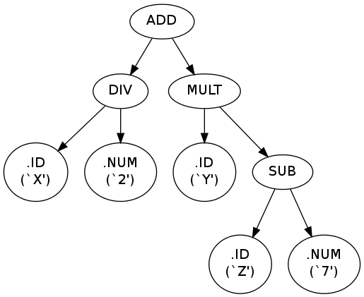

## Description

This is an implementation of the [TREE-META](https://en.wikipedia.org/wiki/TREE-META)
compiler writing system. This version is based on the version of TREE-META for the
ICL 1900 described in [this manual][1].

## Getting started

After executing `make` in the base directory you should get `tmc` and `tmm`.

`tmc` will use a program written in TREE-META to translate a program in the
object language. For example, if we have the description of a compiler for
language X in the file `X.tm` and a program written in language X that we wish
to compile in the file `foo.X`, then the following

    $ ./tmc X.tm foo.X

will use `X.tm` to compile `foo.X` and output the result to `stdout`.

`tmm` is the TREE-META equivalent of the [META II machine][3]. It reads and executes
programs written in its assembly language. It is used to bootstrap the system.

## Bootstrapping

The TREE-META compiler can be written in its own language. The file [treemeta.tm](treemeta.tm)
is a TREE-META program that describes a TREE-META compiler. This compiler translates
TREE-META programs into assembly language for the TREE-META machine (`tmm`).
The bootstrapping process is as follows (this is what the `meta` target of the makefile does):

    $ ./tmc treemeta.tm treemeta.tm >treemeta1.tmm
    $ ./tmm treemeta1.tmm treemeta.tm >treemeta2.tmm
    $ cmp treemeta1.tmm treemeta2.tmm  #should succeed, meaning we reached a fixed point

Note that above we "cheated" by already having a compiler to start with (`tmc`).
We used `tmc` to get a compiled version of `treemeta.tm`. Alternatively, we would
have to first somehow (by hand, for example) translate `treemeta.tm` into assembly.

## Differences and extensions

There are some differences with respect to the version of TREE-META described in
[the manual][1].

The arithmetic expressions recognized are similar in syntax and precedence/associativity
to the ones found in the C language. Signed and unsigned arithmetic is supported
through the introduction of new operators. See the annotated grammar at [grammar.txt](grammar.txt)
for precise details on the syntax recognized.

C style comments (`/*...*/`) are automatically recognized in TREE-META programs
and in the input those programs read. They can appear anywhere whitespace can appear.

The stack used for tree-building is cleared after code generation (initiated by `*`).
The top tree will be processed and everything below will be lost. Generally this
is not a problem because a single tree is passed to the code generation phase.
Code generation must be initiated only from the main syntax rule (the one named
after `.META`).

Dumping of trees in DOT format is supported. After building a tree you can use
`**` instead of `*` to cause the generation of a DOT description of the top tree.
You can render the result with [Graphviz](http://www.graphviz.org/) (you can
do it online [here](http://www.webgraphviz.com/) without installing anything).
Here is an example:

    $ cat expr.tm
    .META PR
    PR = EXPRESSION ** ;
    EXPRESSION = TERM $('+' TERM :ADD[2] / '-' TERM :SUB[2]) ;
    TERM = FACTOR $('*' FACTOR :MULT[2] / '/' FACTOR :DIV[2]) ;
    FACTOR = '+' PRIMARY / '-' PRIMARY :MIN[1] / PRIMARY ;
    PRIMARY = .ID / .NUM / '(' EXPRESSION ')' ;
    ADD /=> .EMPTY ;
    SUB /=> .EMPTY ;
    MIN /=> .EMPTY ;
    MULT /=> .EMPTY ;
    DIV /=> .EMPTY ;
    .END
    $ cat expr.sr
    X/2+Y*(Z-7)
    $ ./tmc expr.tm expr.sr >expr.dot
    $ dot -Tpng expr.dot -o expr.png

and the result:

## References & History

 - [Manual for ICL 1900 version of TREE-META by F R A Hopgood][1]
 - [A TREE META for the XDS 940 by J. F. Rulifson][2]
 - [META II A SYNTAX-ORIENTED COMPILER WRITING LANGUAGE by Dewey Val Schorre][3]
 - [The Tree-Meta Compiler-Compiler System: A Meta Compiler System for the Univac 1108 and the General Electric 645][4]
 - [Jeff Rulifson discussing Tree Meta at "The Mother of All Demos" (Clip 18)][5]
 - [The Mother of All Demos (1968)(Complete video) (the above clip is from around minute 53)][6]
 - [The programming languages behind "the mother of all demos"][7]
 - [Tree Meta in the On-Line System (NLS)][8]
 - Alan Kay about Tree Meta, [here][9] and [here][10]

[1]: http://www.chilton-computing.org.uk/acl/literature/manuals/tree-meta/contents.htm
[2]: http://bitsavers.org/pdf/sri/arc/rulifson/A_Tree_Meta_For_The_XDS_940_Appendix_D_Apr68.pdf
[3]: http://www.ibm-1401.info/Meta-II-schorre.pdf
[4]: https://ntrl.ntis.gov/NTRL/dashboard/searchResults/titleDetail/AD855122.xhtml
[5]: http://web.stanford.edu/dept/SUL/library/extra4/sloan/mousesite/1968Demo.html
[6]: https://www.youtube.com/watch?v=yJDv-zdhzMY
[7]: http://lambda-the-ultimate.org/node/3122
[8]: http://www.dougengelbart.org/pubs/augment-3954.html#4d
[9]: https://en.wikipedia.org/wiki/Talk:TREE-META#Corrections
[10]: http://ibm-1401.info/OtherStories.html#01/09/2013
